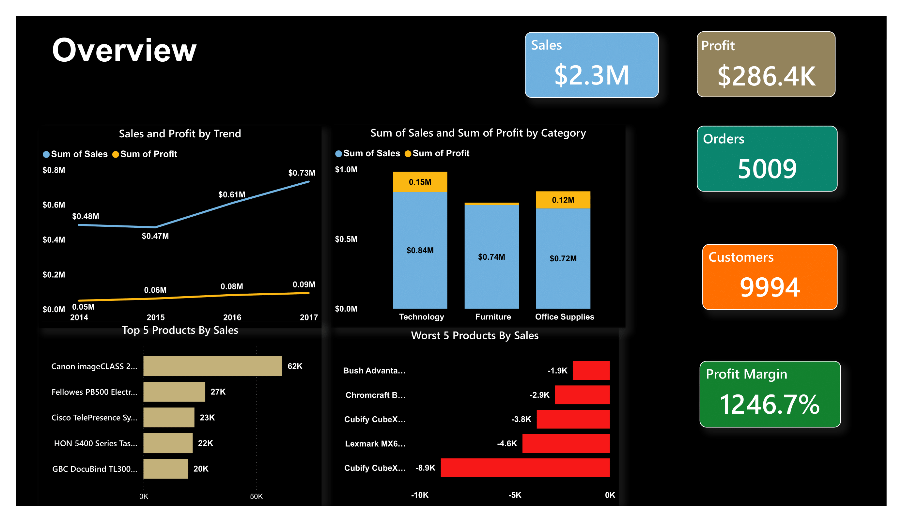
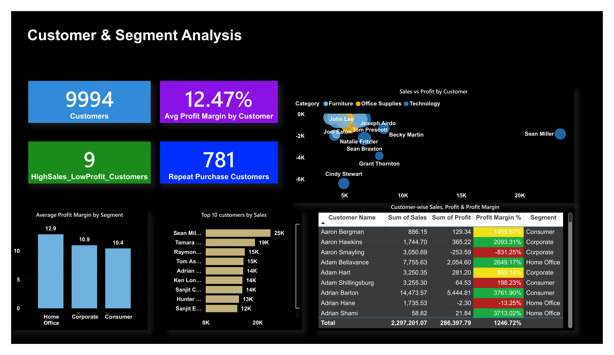
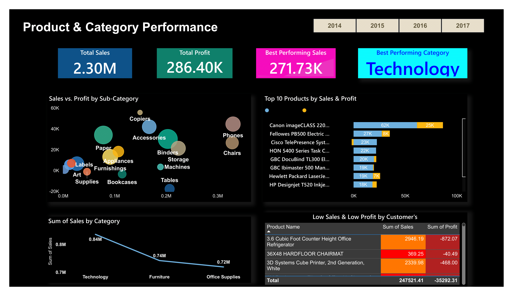
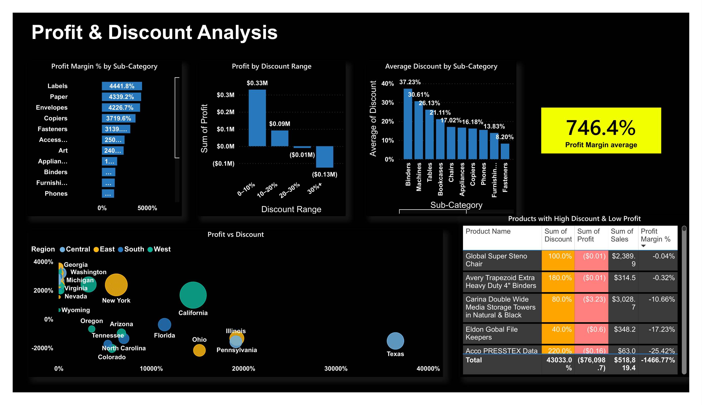
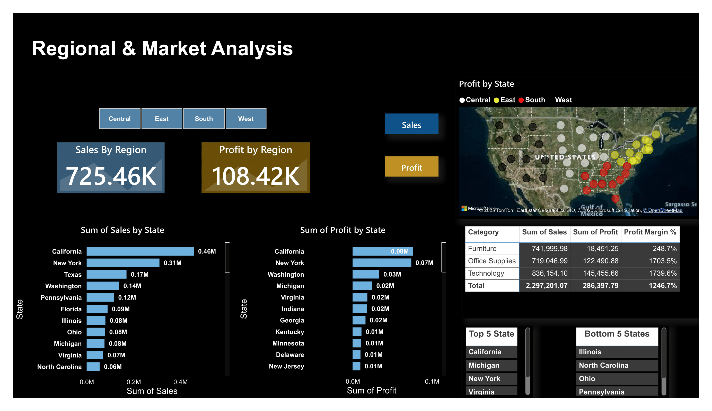

# Sales-Analysis-Dashboard-
Business Intelligence project using Power BI, Python, and SQL for sales data analysis and visualization.
# Sales Performance Analysis Dashboard

A Business Intelligence and Data Analytics project developed to transform 48 months of sales data into actionable business insights. The dashboard provides interactive visualizations, KPI tracking, customer analytics, regional performance analysis, forecasting, and inventory monitoring to support data-driven decision making.

## Key Features
- Executive KPI Dashboard
- Product Performance Analysis
- Customer Segmentation (RFM Analysis)
- Regional & Geographic Sales Analysis
- Sales Representative Performance Tracking
- Time-Series Trend Analysis
- Sales Forecasting & Predictive Analytics
- Inventory & Stock Monitoring
- Interactive Filters and Drill-Down Reports
- Automated Reporting & Export Functionality

## Technology Stack
- Power BI
- Python
- SQL
- Pandas
- NumPy
- DAX
- Excel

## Project Highlights
- Processed and analyzed 4 years of sales data (2020–2024)
- Designed Star Schema Data Warehouse Architecture
- Implemented ETL pipelines using Python
- Developed forecasting models for future sales prediction
- Created interactive dashboards with advanced filtering and visualization

## Repository Contents
- Project Report PDF
- Dashboard Screenshots
- Sales Dataset
- Documentation

## Author
Hemant

## Dashboard Screenshots

### Overview Dashboard

### Customer & Segment Analysis

### Product & Category Performance

### Profit & Discount Analysis

### Regional Market Analysis

### Sales Pipeline & Opportunity Tracking
![Sales
